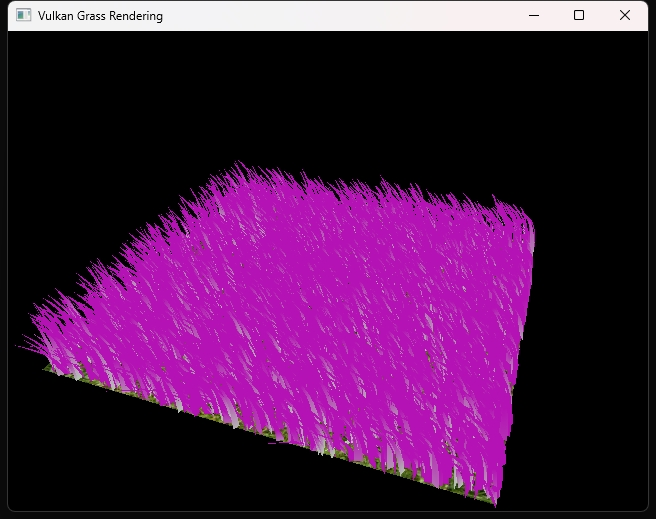

Vulkan Grass Rendering
==================================

**University of Pennsylvania, CIS 565: GPU Programming and Architecture, Project 5**

* Runjie Zhao
* Tested on: Windows 11, i9 185H 2500 Mhz, GTX 4080 Laptop GPU

### Final Result

In this project, I developed a grass simulation using the Vulkan API, showcasing the high-performance rendering capabilities Vulkan offers. This simulation involves creating realistic grass blades that react dynamically to environmental factors like wind and lighting, producing a visually immersive experience. By leveraging Vulkan's low-level control over GPU resources, I optimized rendering efficiency, allowing for complex computations required to simulate grass movement and natural shading effects. Besides it, I also implemented Orientation culling, View-frustrum culling and distance culling for better optimization

### Performance Analysis

The graph above shows the fps vs number of leave blades. As we can tell from the graph above, the fps stays almost same before 2^10 blades. When it comes to 2^15 blades, the fps drops drastically.

The graph above displays the fps vs different culling methods. As we can see from the graph above, view frustrum culling and orientation culling methods can obviously help to improve the fps. Although distance culling can also help to improve fps, it does not make significant improvement to it.